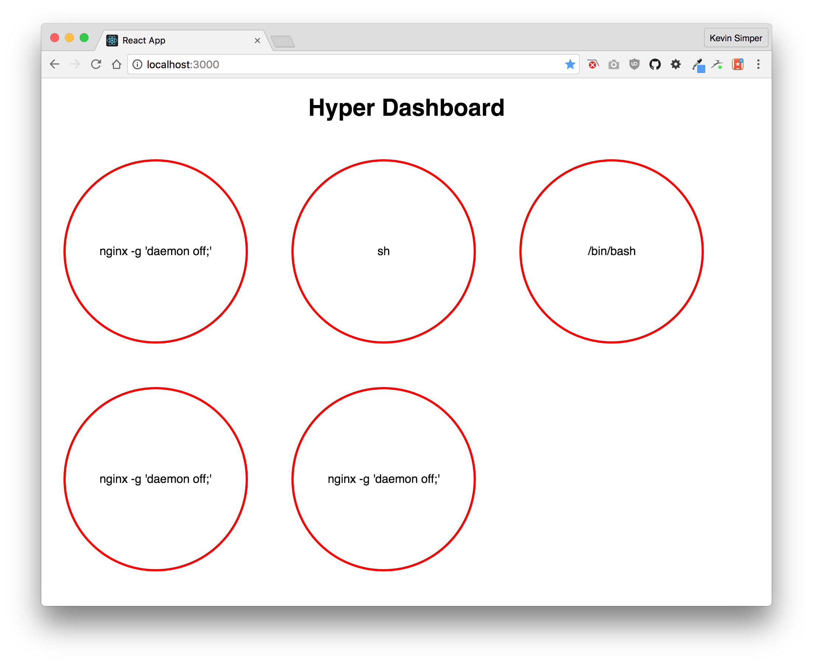

# Hyper Dashboard

A automatic dashboard for Hyper that can show you in realtime what is going on!

```
$ hyper run \
  -e HYPER_ACCESS=$HYPER_ACCESS \
  -e HYPER_SECRET=$HYPER_SECRET \
  -d -P kevinsimper/hyper-dashboard
```


