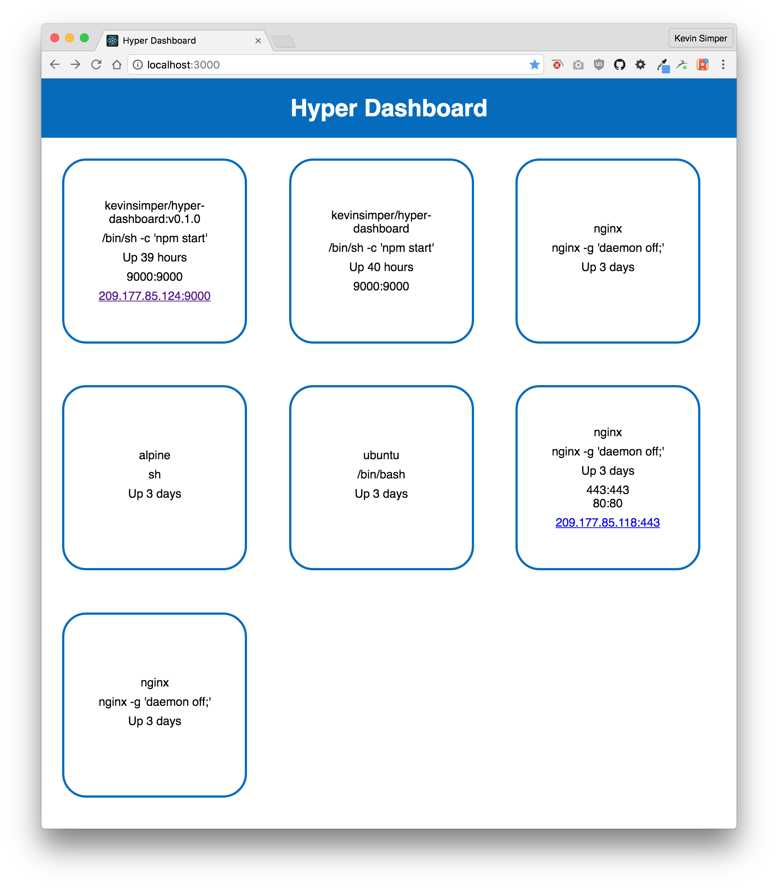

# Hyper Dashboard

A automatic dashboard for Hyper that can show you in realtime what is going on!



## How to use

```
$ hyper run \
  --name dashboard
  -e HYPER_ACCESS=$HYPER_ACCESS \
  -e HYPER_SECRET=$HYPER_SECRET \
  -d -P kevinsimper/hyper-dashboard:v0.2.0
```

then attach a IP

```
$ hyper fip attach IP_HERE dashboard
```
